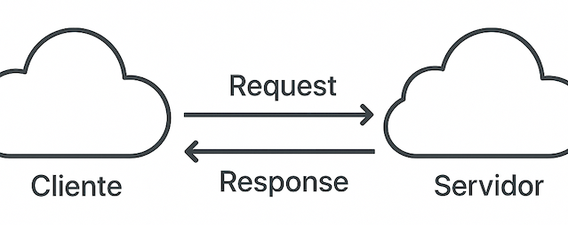

# Design e Arquitetura I - 12/04/2025

## Desenvolvimento Web (Revisão Geral)

### Conceito Cliente-Servidor

Arquitetura cliente-servidor: tipo de arquitetura em que parte do processamento está no lado cliente e parte está no lado servidor.



#### O Protocolo HTTP(S)

Uma operação é **idempotente** quando executá-la várias vezes tem o mesmo efeito que executá-la uma vez.

- Os métodos `GET`, `PUT`, `DELETE` e `PATCH` (geralmente) são.
- O método `POST` não é, pois cada chamada normalmente cria algo novo.


Em uma API REST, os verbos (ou métodos) HTTP são usados para indicar a ação que o cliente quer executar sobre um recurso (como um usuário, produto, pedido etc.).

Segue uma tabela resumo com os principais métodos HTTP e seu uso típico em APIs REST:

| Método  | Ação               | Uso Típico                                     | Idempotente? | Possui corpo?         |
|---------|--------------------|------------------------------------------------|--------------|-----------------------|
| GET     | Ler (consultar)    | Buscar dados (ex: lista de usuários)           | ✅ Sim       | ❌ Normalmente não     |
| POST    | Criar              | Criar um novo recurso (ex: novo usuário)       | ❌ Não       | ✅ Sim                 |
| PUT     | Atualizar (total)  | Atualizar um recurso inteiro                   | ✅ Sim       | ✅ Sim                 |
| PATCH   | Atualizar (parcial)| Atualizar parte de um recurso                  | ✅ Sim       | ✅ Sim                 |
| DELETE  | Remover            | Deletar um recurso                             | ✅ Sim       | ❌ Opcional            |
| HEAD    | Cabeçalho          | Igual ao GET, mas retorna só os headers        | ✅ Sim       | ❌ Não                 |
| OPTIONS | Opções             | Verifica métodos permitidos para o recurso     | ✅ Sim       | ❌ Não                 |


- Exemplos práticos com recurso `usuarios`

| Verbo  | Rota REST       | Ação                                      |
|--------|------------------|------------------------------------------|
| GET    | /usuarios        | Retorna a lista de usuários              |
| GET    | /usuarios/42     | Retorna dados do usuário com ID 42       |
| POST   | /usuarios        | Cria um novo usuário                     |
| PUT    | /usuarios/42     | Atualiza totalmente o usuário 42         |
| PATCH  | /usuarios/42     | Atualiza parcialmente o usuário 42       |
| DELETE | /usuarios/42     | Remove o usuário com ID 42               |

- Verbos HTTP x Status Codes comuns

| Verbo   | Status Code               | Significado                                         |
|---------|---------------------------|-----------------------------------------------------|
| GET     | 200 OK                    | Sucesso ao buscar recurso                          |
|         | 304 Not Modified          | Conteúdo não mudou (cache)                         |
|         | 404 Not Found             | Recurso não encontrado                             |
| POST    | 201 Created               | Recurso criado com sucesso                         |
|         | 400 Bad Request           | Dados inválidos ou malformados                     |
|         | 409 Conflict              | Conflito ao tentar criar (ex: duplicidade)         |
| PUT     | 200 OK / 204 No Content   | Atualização feita com sucesso                      |
|         | 404 Not Found             | Recurso a ser atualizado não existe                |
|         | 400 Bad Request           | Dados inválidos                                    |
| PATCH   | 200 OK / 204 No Content   | Atualização parcial feita com sucesso              |
|         | 400 Bad Request           | Dados inválidos                                    |
|         | 404 Not Found             | Recurso não existe                                 |
| DELETE  | 200 OK / 204 No Content   | Recurso deletado com sucesso                       |
|         | 404 Not Found             | Recurso já não existe                              |
| HEAD    | 200 OK                    | Cabeçalhos do recurso estão disponíveis            |
| OPTIONS | 204 No Content            | Métodos permitidos informados, sem corpo de resposta |

- Categorias de status HTTP

| Faixa | Tipo                | Exemplo                                           |
|-------|---------------------|---------------------------------------------------|
| 1xx   | Informativo         | 100 Continue                                     |
| 2xx   | Sucesso             | 200 OK, 201 Created                              |
| 3xx   | Redirecionamento    | 301 Moved Permanently, 304 Not Modified          |
| 4xx   | Erro do cliente     | 400 Bad Request, 404 Not Found                   |
| 5xx   | Erro do servidor    | 500 Internal Server Error, 503 Service Unavailable |

#### Autenticação vs. Autorização

**1. Autenticação**

A autenticação é o processo de verificar a identidade de um usuário, garantindo que ele é quem diz ser. Em outras palavras, a autenticação responde à pergunta: "Quem é você?".

Durante a autenticação, o sistema verifica as credenciais fornecidas, como nome de usuário e senha, ou outros métodos de autenticação como biometria, autenticação de dois fatores (2FA), ou autenticação baseada em tokens.

**Exemplos de autenticação:**

- Nome de usuário e senha: O usuário fornece seu nome de usuário e uma senha. Se as credenciais corresponderem a um registro válido, o usuário é autenticado.
- Tokens de autenticação: Por exemplo, o uso de um token JWT (JSON Web Token) ou OAuth para autenticar a identidade do usuário, geralmente usado em APIs.

**2. Autorização**

A autorização ocorre após a autenticação. Ela é o processo de determinar quais recursos ou ações um usuário autenticado pode acessar ou realizar dentro de um sistema. A autorização verifica se um usuário tem permissão para executar uma ação ou acessar um recurso.

A autorização responde à pergunta: "O que você pode fazer?"

**Exemplos de autorização:**

- Controle de acesso baseado em papéis (RBAC): O sistema verifica se o usuário possui um papel (por exemplo, "admin", "usuário", "moderador") e concede ou nega permissões com base nesse papel. Por exemplo, um administrador pode ter permissão para adicionar ou excluir usuários, enquanto um usuário regular não pode.
- Listas de controle de acesso (ACLs): O sistema verifica as permissões de acesso de um usuário para um recurso específico. Por exemplo, um arquivo pode ser acessado apenas por usuários com permissão de leitura ou escrita.
- Permissões de recursos em nuvem: Um sistema de armazenamento em nuvem pode permitir que um usuário acesse somente seus próprios arquivos, enquanto nega o acesso a arquivos de outros usuários, mesmo que todos estejam autenticados na plataforma.

**Diferença entre Autenticação e Autorização:**

- Autenticação: Verifica a identidade do usuário. (Exemplo: "Você é quem diz que é?")
- Autorização: Define o que o usuário pode fazer ou acessar após ser autenticado. (Exemplo: "O que você pode fazer?")

**Fluxo Típico:**

1. Autenticação: O usuário entra no sistema com suas credenciais.
2. Autorização: Depois de autenticado, o sistema verifica se ele tem permissão para acessar recursos ou executar ações específicas.

**Exemplo prático:**

Autenticação: Um usuário acessa um site e faz login com seu nome de usuário e senha. O sistema valida essas credenciais e confirma que ele é um usuário legítimo.

Autorização: Após o login, o sistema verifica se o usuário tem permissão para acessar determinados recursos, como o painel de administração, dados sensíveis ou outros conteúdos protegidos. Um usuário comum pode ter acesso apenas a algumas páginas, enquanto um administrador pode acessar configurações avançadas.

### Comunicação Síncrona e Assíncrona

- Comunicação Síncrona
  - Uma parte espera a outra terminar antes de continuar.
  - Exige que remetente e receptor estejam disponíveis ao mesmo tempo.
  - Usado em chamada de método ou requisição HTTP tradicional.
  - Exemplo:
    ```java
    import java.net.URI;
    import java.net.http.HttpClient;
    import java.net.http.HttpRequest;
    import java.net.http.HttpResponse;

    public class ExemploSincrono {
        public static void main(String[] args) throws Exception {
            HttpClient client = HttpClient.newHttpClient();

            HttpRequest request = HttpRequest.newBuilder()
                .uri(URI.create("https://jsonplaceholder.typicode.com/posts/1"))
                .build();

            // Chamada bloqueante
            HttpResponse<String> response = client.send(request, HttpResponse.BodyHandlers.ofString());

            System.out.println("Status: " + response.statusCode());
            System.out.println("Resposta: " + response.body());
        }
    }
    ```

- Comunicação Assíncrona
  - As partes não precisam esperar.
  - A comunicação acontece de forma independente, geralmente com eventos, filas ou callbacks.
  - Usado em sistemas reativos, mensageria, programação concorrente, etc.
  - Exemplo:
    ```java
    import java.net.URI;
    import java.net.http.HttpClient;
    import java.net.http.HttpRequest;
    import java.net.http.HttpResponse;
    import java.util.concurrent.CompletableFuture;

    public class ExemploAssincrono {
        public static void main(String[] args) {
            HttpClient client = HttpClient.newHttpClient();

            HttpRequest request = HttpRequest.newBuilder()
                .uri(URI.create("https://jsonplaceholder.typicode.com/posts/1"))
                .build();

            // Chamada não bloqueante
            CompletableFuture<HttpResponse<String>> future =
                client.sendAsync(request, HttpResponse.BodyHandlers.ofString());

            System.out.println("Requisição enviada. Fazendo outras coisas...");

            // Mais tarde, quando a resposta chegar:
            future.thenAccept(response -> {
                System.out.println("Status: " + response.statusCode());
                System.out.println("Resposta: " + response.body());
            });

            // Evita que o programa termine antes da resposta (só pro exemplo funcionar)
            future.join();
        }
    }
    ```

### Modelos de Arquitetura: Monolítico e Modularizado

### Introdução a APIs e WebServices

### Conceitos e Vantagens do MVC

### Princípios SOLID

- **S: Single Responsibility Principle (Princípio da Responsabilidade Única)**

  Uma classe deve ter um e somente um motivo para mudar, isto é, uma classe deve ter apenas uma responsabilidade ou função dentro do sistema.

  Isso não significa que a classe deve ter APENAS UM método, mas que deve ter métodos coerentes com o contexto da classe.

  Exemplo:

  - **Errado:** uma classe faz tudo (salva no banco de dados e envia e-mail)

    ```java
    public class UsuarioRepository {
        public void salvar(Usuario u) {
            // Salva um usuário no banco de dados
        }
    }

    public class EmailService {
        public void enviarBoasVindas(Usuario u) {
            // Envia e-mail de boas vindas para o usuário
        }
    }
    ```

  - **Correto:** uma classe para cada responsabilidade

    ```java
    public class UsuarioService {
        public void salvarUsuario(Usuario u) {
            // Salva um usuário no banco de dados
        }
        public void enviarEmailBoasVindas(Usuario u) {
            // Envia e-mail de boas vindas para o usuário
        }
    }
    ```

- **O: Open/Closed Principle (Princípio Aberto/Fechado)**

  Entidades (classes, módulos, funções, etc.) devem estar abertas para extensão, mas fechadas para modificação, isto é, você deve conseguir adicionar novos comportamentos ou estender uma classe sem precisar alterar o código existente.

  Exemplo:

  ```java
  public interface Desconto {
      double aplicar(double preco);
  }

  public class DescontoNatal implements Desconto {
      public double aplicar(double preco) {
        return preco * 0.9;
      }
  }

  public class DescontoClienteVip implements Desconto {
      public double aplicar(double preco) {
        return preco * 0.85;
      }
  }
  ```

  Se precisar adicionar mais algum desconto, apenas crie uma nova classe; não precisa alterar as outras já criadas.

- **L: Liskov Substitution Principle (Princípio da Substituição de Liskov)**

  Objetos de uma superclasse devem poder ser substituídos por objetos de suas subclasses sem alterar o funcionamento correto do programa, isto é, uma subclasse deve manter o funcionamento esperado da classe pai.

  Exemplo:

  - **Errado:** subclasse quebra comportamento esperado

    ```java
    public class Retangulo {
        private int largura, altura;
        public void setLargura(int l) {
            this.largura = l;
        }
        public void setAltura(int a) {
            this.altura = a;
        }
        public int getArea() {
            return this.largura * this.altura;
        }
    }

    public class Quadrado extends Retangulo {
        public void setLargura(int l) {
            // Quebra o comportamento esperado
            this.largura = l;
            this.altura = l;
        }
    }
    ```

  - **Correto:** separar responsabilidades corretamente

    ```java
    interface Forma {
        int getArea();
    }

    public class Retangulo implements Forma {
        private int largura, altura;
        public Retangulo(int l, int a) {
            this.largura = l;
            this.altura = a;
        }
        public int getArea() {
            return this.largura * this.altura;
        }
    }

    public class Quadrado implements Forma {
        private int lado;
        public Quadrado(int l) {
            this.lado = l;
        }
        public int getArea() {
            return this.lado * this.lado;
        }
    }
    ```

- **I: Interface Segregation Principle (Princípio da Segregação de Interface)**

  Uma classe não deve ser forçada a depender de interfaces que ela não utiliza, isto é, é melhor criar várias interfaces específicas do que uma interface genérica que obriga a implementação de métodos desnecessários.

  Exemplo:

  - **Errado:** interface muito genérica
    ```java
    interface Maquina {
        void imprimir();
        void escanear();
        void enviarFax();
    }

    public class Impressora implements Maquina {
        public void imprimir() {
            // Imprime um documento
        }
        public void escanear() {
            // Não escaneia documentos; poderia lançar uma exceção
        }
        public void enviarFax() {
            // Não envia fax; poderia lançar uma exceção
        }
    }
    ```

  - **Correto:** interfaces menores e mais específicas

    ```java
    interface Impressora {
        void imprimir();
    }

    interface Scanner {
        void escanear();
    }

    interface Fax {
        void enviar();
    }

    public class ImpressoraBasica implements Impressora {
        public void imprimir() {
            // Imprime um documento
        }
    }

    public class ImpressoraMultifuncional implements Impressora, Scanner {
        public void imprimir() {
            // Imprime um documento
        }
        public void escanear() {
            // Escaneia um documento
        }
    }

    public class ImpressoraMultifuncionalEFax implements Impressora, Scanner, Fax {
        public void imprimir() {
            // Imprime um documento
        }
        public void escanear() {
            // Escaneia um documento
        }
        public void enviar() {
            // Envia um fax
        }
    }
    ```

- **D: Dependency Inversion Principle (Princípio da Inversão de Dependência)**

  Módulos de alto nível não devem depender de módulos de baixo nível; ambos devem depender de abstrações, isto é, utilize interfaces para desacoplar as classes de alto nível para de baixo nível.

  Exemplo:

  - **Errado:** classe depende de uma implementação concreta

    ```java
    public class ConexaoMysql {
        public void conectar() {
            // Conecta a um SGBD MySQL
        }
    }

    public class UsuarioRepository {
        private ConexaoMysql conexao;
        public UsuarioRepository(ConexaoMysql conexao) {
            this.conexao = conexao;
        }
        public salvar(Usuario u) {
            // Conecta a um SGBD MySql
            this.conexao.connecta(...);
        }
    }
    ```

  - **Correto:** injeção de dependência via abstração

    ```java
    interface Conexao {
        void conectar();
    }

    public class ConexaoMysql implements Conexao {
        public void conectar() {
            // Conecta a um SGBD MySQL
        }
    }

    public class UsuarioRepository {
        private Conexao conexao;
        public UsuarioRepository(Conexao conexao) {
            this.conexao = conexao;
        }
        public salvar(Usuario u) {
            // Conecta a um SGBD que pode ou não ser MySQL
            this.conexao.connecta(...);
        }
    }
    ```
