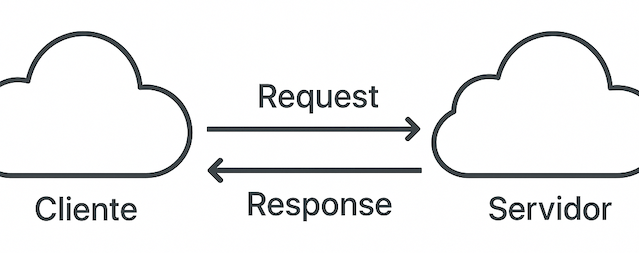
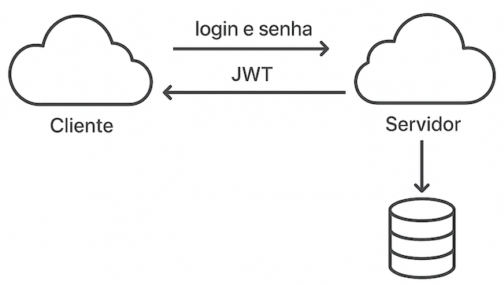

# Design e Arquitetura I - 12/04/2025

## Desenvolvimento Web (Revisão Geral)

### Conceito Cliente-Servidor

Arquitetura cliente-servidor: tipo de arquitetura em que parte do processamento está no lado cliente e parte está no lado servidor.



#### O Protocolo HTTP(S)

Uma operação é **idempotente** quando executá-la várias vezes tem o mesmo efeito que executá-la uma vez.

- Os métodos `GET`, `PUT`, `DELETE` e `PATCH` (geralmente) são.
- O método `POST` não é, pois cada chamada normalmente cria algo novo.


Em uma API REST, os verbos (ou métodos) HTTP são usados para indicar a ação que o cliente quer executar sobre um recurso (como um usuário, produto, pedido etc.).

Segue uma tabela resumo com os principais métodos HTTP e seu uso típico em APIs REST:

| Método  | Ação               | Uso Típico                                     | Idempotente? | Possui corpo?         |
|---------|--------------------|------------------------------------------------|--------------|-----------------------|
| GET     | Ler (consultar)    | Buscar dados (ex: lista de usuários)           | ✅ Sim       | ❌ Normalmente não     |
| POST    | Criar              | Criar um novo recurso (ex: novo usuário)       | ❌ Não       | ✅ Sim                 |
| PUT     | Atualizar (total)  | Atualizar um recurso inteiro                   | ✅ Sim       | ✅ Sim                 |
| PATCH   | Atualizar (parcial)| Atualizar parte de um recurso                  | ✅ Sim       | ✅ Sim                 |
| DELETE  | Remover            | Deletar um recurso                             | ✅ Sim       | ❌ Opcional            |
| HEAD    | Cabeçalho          | Igual ao GET, mas retorna só os headers        | ✅ Sim       | ❌ Não                 |
| OPTIONS | Opções             | Verifica métodos permitidos para o recurso     | ✅ Sim       | ❌ Não                 |


- Exemplos práticos com recurso `usuarios`

| Verbo  | Rota REST       | Ação                                      |
|--------|------------------|------------------------------------------|
| GET    | /usuarios        | Retorna a lista de usuários              |
| GET    | /usuarios/42     | Retorna dados do usuário com ID 42       |
| POST   | /usuarios        | Cria um novo usuário                     |
| PUT    | /usuarios/42     | Atualiza totalmente o usuário 42         |
| PATCH  | /usuarios/42     | Atualiza parcialmente o usuário 42       |
| DELETE | /usuarios/42     | Remove o usuário com ID 42               |

- Verbos HTTP x Status Codes comuns

| Verbo   | Status Code               | Significado                                         |
|---------|---------------------------|-----------------------------------------------------|
| GET     | 200 OK                    | Sucesso ao buscar recurso                          |
|         | 304 Not Modified          | Conteúdo não mudou (cache)                         |
|         | 404 Not Found             | Recurso não encontrado                             |
| POST    | 201 Created               | Recurso criado com sucesso                         |
|         | 400 Bad Request           | Dados inválidos ou malformados                     |
|         | 409 Conflict              | Conflito ao tentar criar (ex: duplicidade)         |
| PUT     | 200 OK / 204 No Content   | Atualização feita com sucesso                      |
|         | 404 Not Found             | Recurso a ser atualizado não existe                |
|         | 400 Bad Request           | Dados inválidos                                    |
| PATCH   | 200 OK / 204 No Content   | Atualização parcial feita com sucesso              |
|         | 400 Bad Request           | Dados inválidos                                    |
|         | 404 Not Found             | Recurso não existe                                 |
| DELETE  | 200 OK / 204 No Content   | Recurso deletado com sucesso                       |
|         | 404 Not Found             | Recurso já não existe                              |
| HEAD    | 200 OK                    | Cabeçalhos do recurso estão disponíveis            |
| OPTIONS | 204 No Content            | Métodos permitidos informados, sem corpo de resposta |

- Principais HTTP status code

    **1xx – Informativo**

    | Código | Significado           | Descrição                                     |
    |--------|-----------------------|-----------------------------------------------|
    | 100    | Continue              | Cliente pode continuar a requisição           |
    | 101    | Switching Protocols   | Mudança de protocolo (ex: para WebSocket)     |

    ---

    **2xx – Sucesso**

    | Código | Significado           | Descrição                                     |
    |--------|-----------------------|-----------------------------------------------|
    | 200    | OK                    | Requisição bem-sucedida                       |
    | 201    | Created               | Recurso criado com sucesso                    |
    | 202    | Accepted              | Requisição aceita, mas ainda não processada   |
    | 204    | No Content            | Sucesso, mas sem conteúdo na resposta         |

    ---

    **3xx – Redirecionamento**

    | Código | Significado           | Descrição                                     |
    |--------|-----------------------|-----------------------------------------------|
    | 301    | Moved Permanently     | URL mudou permanentemente                    |
    | 302    | Found                 | Redirecionamento temporário                  |
    | 303    | See Other             | Ver outro recurso (GET)                       |
    | 304    | Not Modified          | Recurso não mudou (útil para cache)           |
    | 307    | Temporary Redirect    | Redirecionamento temporário (mantém método)   |
    | 308    | Permanent Redirect    | Redirecionamento permanente (mantém método)   |

    ---

    **4xx – Erro do Cliente**

    | Código | Significado           | Descrição                                     |
    |--------|-----------------------|-----------------------------------------------|
    | 400    | Bad Request           | Requisição inválida                           |
    | 401    | Unauthorized          | Requer autenticação                           |
    | 403    | Forbidden             | Acesso negado                                 |
    | 404    | Not Found             | Recurso não encontrado                        |
    | 405    | Method Not Allowed    | Método HTTP não permitido                     |
    | 409    | Conflict              | Conflito de estado (ex: duplicado)            |
    | 422    | Unprocessable Entity  | Entidade inválida (comum em APIs REST)        |
    | 429    | Too Many Requests     | Muitas requisições em pouco tempo             |

    ---

    **5xx – Erro do Servidor**

    | Código | Significado           | Descrição                                     |
    |--------|-----------------------|-----------------------------------------------|
    | 500    | Internal Server Error | Erro genérico do servidor                     |
    | 501    | Not Implemented       | Funcionalidade não implementada               |
    | 502    | Bad Gateway           | Resposta inválida do servidor intermediário   |
    | 503    | Service Unavailable   | Servidor indisponível (manutenção/sobrecarga)|
    | 504    | Gateway Timeout       | Tempo de resposta excedido do servidor        |

#### Autenticação vs. Autorização

**1. Autenticação**

A autenticação é o processo de verificar a identidade de um usuário, garantindo que ele é quem diz ser. Em outras palavras, a autenticação responde à pergunta: "Quem é você?".

Durante a autenticação, o sistema verifica as credenciais fornecidas, como nome de usuário e senha, ou outros métodos de autenticação como biometria, autenticação de dois fatores (2FA), ou autenticação baseada em tokens.



**Exemplos de autenticação:**

- Nome de usuário e senha: O usuário fornece seu nome de usuário e uma senha. Se as credenciais corresponderem a um registro válido, o usuário é autenticado.
- Tokens de autenticação: Por exemplo, o uso de um token JWT (JSON Web Token) ou OAuth para autenticar a identidade do usuário, geralmente usado em APIs.

**2. Autorização**

A autorização ocorre após a autenticação. Ela é o processo de determinar quais recursos ou ações um usuário autenticado pode acessar ou realizar dentro de um sistema. A autorização verifica se um usuário tem permissão para executar uma ação ou acessar um recurso.

A autorização responde à pergunta: "O que você pode fazer?"

**Exemplos de autorização:**

- Controle de acesso baseado em papéis (RBAC): O sistema verifica se o usuário possui um papel (por exemplo, "admin", "usuário", "moderador") e concede ou nega permissões com base nesse papel. Por exemplo, um administrador pode ter permissão para adicionar ou excluir usuários, enquanto um usuário regular não pode.
- Listas de controle de acesso (ACLs): O sistema verifica as permissões de acesso de um usuário para um recurso específico. Por exemplo, um arquivo pode ser acessado apenas por usuários com permissão de leitura ou escrita.
- Permissões de recursos em nuvem: Um sistema de armazenamento em nuvem pode permitir que um usuário acesse somente seus próprios arquivos, enquanto nega o acesso a arquivos de outros usuários, mesmo que todos estejam autenticados na plataforma.

**Diferença entre Autenticação e Autorização:**

- Autenticação: Verifica a identidade do usuário. (Exemplo: "Você é quem diz que é?")
- Autorização: Define o que o usuário pode fazer ou acessar após ser autenticado. (Exemplo: "O que você pode fazer?")

**Fluxo Típico:**

1. Autenticação: O usuário entra no sistema com suas credenciais.
2. Autorização: Depois de autenticado, o sistema verifica se ele tem permissão para acessar recursos ou executar ações específicas.

**Exemplo prático:**

Autenticação: Um usuário acessa um site e faz login com seu nome de usuário e senha. O sistema valida essas credenciais e confirma que ele é um usuário legítimo.

Autorização: Após o login, o sistema verifica se o usuário tem permissão para acessar determinados recursos, como o painel de administração, dados sensíveis ou outros conteúdos protegidos. Um usuário comum pode ter acesso apenas a algumas páginas, enquanto um administrador pode acessar configurações avançadas.

### Comunicação Síncrona e Assíncrona

- Comunicação Síncrona
  - Uma parte espera a outra terminar antes de continuar.
  - Exige que remetente e receptor estejam disponíveis ao mesmo tempo.
  - Usado em chamada de método ou requisição HTTP tradicional.
  - Exemplo:
    ```java
    import java.net.URI;
    import java.net.http.HttpClient;
    import java.net.http.HttpRequest;
    import java.net.http.HttpResponse;

    public class ExemploSincrono {
        public static void main(String[] args) throws Exception {
            HttpClient client = HttpClient.newHttpClient();

            HttpRequest request = HttpRequest.newBuilder()
                .uri(URI.create("https://jsonplaceholder.typicode.com/posts/1"))
                .build();

            // Chamada bloqueante
            HttpResponse<String> response = client.send(request, HttpResponse.BodyHandlers.ofString());

            System.out.println("Status: " + response.statusCode());
            System.out.println("Resposta: " + response.body());
        }
    }
    ```

- Comunicação Assíncrona
  - As partes não precisam esperar.
  - A comunicação acontece de forma independente, geralmente com eventos, filas ou callbacks.
  - Usado em sistemas reativos, mensageria, programação concorrente, etc.
  - Exemplo:
    ```java
    import java.net.URI;
    import java.net.http.HttpClient;
    import java.net.http.HttpRequest;
    import java.net.http.HttpResponse;
    import java.util.concurrent.CompletableFuture;

    public class ExemploAssincrono {
        public static void main(String[] args) {
            HttpClient client = HttpClient.newHttpClient();

            HttpRequest request = HttpRequest.newBuilder()
                .uri(URI.create("https://jsonplaceholder.typicode.com/posts/1"))
                .build();

            // Chamada não bloqueante
            CompletableFuture<HttpResponse<String>> future =
                client.sendAsync(request, HttpResponse.BodyHandlers.ofString());

            System.out.println("Requisição enviada. Fazendo outras coisas...");

            // Mais tarde, quando a resposta chegar:
            future.thenAccept(response -> {
                System.out.println("Status: " + response.statusCode());
                System.out.println("Resposta: " + response.body());
            });

            // Evita que o programa termine antes da resposta (só pro exemplo funcionar)
            future.join();
        }
    }
    ```

### Modelos de Arquitetura: Monolítico, Modularizado e Microserviços

#### Arquitetura Monolítica

Um sistema com arquitetura monolítica é aquele em que todos os componentes de uma aplicação são construídos e implantados juntos como uma única unidade. Esse modelo era (e ainda é, em muitos casos) amplamente utilizado no desenvolvimento de software.

**Vantagens:**

1. Facilidade de desenvolvimento inicial
- É mais simples começar com um monólito, especialmente para projetos pequenos ou equipes menores.
- Toda a aplicação é construída em um único repositório e compilada de uma vez.

2. Desenvolvimento mais rápido no início
- Sem necessidade de configurar comunicação entre serviços ou lidar com deploys separados.
- Menos complexidade estrutural comparado a arquiteturas distribuídas.

3. Facilidade de testes
- Como tudo está junto, é mais fácil fazer testes end-to-end (fim a fim), já que não há múltiplas dependências externas.

4. Desempenho interno melhor
- Comunicação entre componentes é feita em memória, o que é mais rápido do que chamadas em rede (como em microserviços).

5. Gerenciamento e implantação simples
- A aplicação inteira pode ser implantada de uma vez, com um único comando/script, sem a necessidade de orquestração complexa.

**Desvantagens:**

1. Dificuldade de escalar partes específicas
- A escala é feita do sistema como um todo. Se apenas uma parte da aplicação precisa de mais recursos, você é forçado a escalar tudo, o que pode ser ineficiente.

2. Código-fonte complexo e acoplado
- Com o tempo, o sistema pode virar um "monstro" difícil de entender e manter, especialmente com múltiplas equipes mexendo nas mesmas partes.

3. Implantações mais arriscadas
- Qualquer alteração exige a reimplantação do sistema inteiro. Um pequeno bug pode derrubar toda a aplicação.

4. Menor flexibilidade tecnológica
- Todo o sistema geralmente é desenvolvido com uma única linguagem/plataforma. É mais difícil adotar novas tecnologias em partes isoladas da aplicação.

5. Barreiras ao crescimento da equipe
- Grandes times trabalhando em um mesmo projeto podem enfrentar conflitos frequentes, problemas de versionamento e dependências internas difíceis de controlar.

**Quando usar:**

- Projetos pequenos ou com escopo bem definido.
- Startups ou MVPs que precisam ir rápido ao mercado.
- Equipes pequenas com recursos limitados.
- Aplicações que não exigem escalabilidade muito granular.

**Quando evitar:**

- Projetos com muitos módulos independentes.
- Quando há necessidade de escalar partes do sistema de forma independente.
- Equipes grandes ou distribuídas.
- Sistemas com alta complexidade de negócio.

#### Arquitetura Modularizada

A arquitetura modularizada é uma abordagem intermediária entre um monólito tradicional e uma arquitetura de microserviços. Em vez de uma única base de código completamente acoplada, o sistema é dividido em módulos independentes dentro do mesmo deploy — ou seja, a aplicação ainda é implantada como um todo (como no monólito), mas organizada de forma mais limpa e separada em domínios ou funcionalidades.

**Vantagens:**

1. Organização do código
- Cada módulo é responsável por uma parte específica do sistema (ex: módulo de usuários, de pagamentos, de produtos
- Facilita a manutenção, leitura e evolução do código.

2. Baixo acoplamento e alta coesão
- Os módulos têm responsabilidades bem definidas e interagem por interfaces bem estabelecidas, reduzindo o impacto de mudanças internas.

3. Reutilização e testabilidade
- Componentes modulares são mais fáceis de testar isoladamente e, em muitos casos, podem ser reaproveitados em outros projetos.

4. Preparação para microserviços
- Uma aplicação modular pode ser refatorada gradualmente em microserviços no futuro, pois já está separada em domínios.

5. Menor complexidade operacional
- Ao contrário dos microserviços, não exige infraestrutura complexa de orquestração, monitoramento e comunicação em rede.

6. Melhor escalabilidade da equipe
- Equipes podem trabalhar em módulos diferentes com menos conflitos, acelerando o desenvolvimento em paralelo.

**Desvantagens:**

1. Complexidade na separação
- Exige planejamento e disciplina para manter os limites entre os módulos bem definidos e evitar o acoplamento disfarçado.

2. Gestão de dependências
- Dependências entre módulos mal gerenciadas podem virar uma "teia" complexa e acabar recriando o acoplamento do monólito tradicional.

3. Deploy ainda é monolítico
- Mesmo que o sistema seja modular, ele é implantado como um todo, ou seja, qualquer alteração exige o deploy completo.

4. Curva de aprendizado
- Desenvolvedores precisam entender bem os conceitos de design modular, DDD (Domain-Driven Design) e princípios como SOLID para tirar proveito da abordagem.

5. Ferramentas e estrutura
- Dependendo da linguagem ou framework, pode ser necessário configurar ferramentas adicionais para suportar módulos (ex: multi-modules em Java/Kotlin, monorepos com workspaces em JavaScript, etc.).

**Quando usar:**

- Projetos de médio a grande porte que ainda não precisam da complexidade de microserviços.
- Times que querem organizar melhor o código desde o início, pensando no futuro.
- Sistemas com múltiplos domínios (ex: ERP, e-commerce, plataforma educacional).
- Quando há intenção futura de migrar para microserviços.

**Quando evitar:**

- Projetos pequenos, com escopo simples, onde a modularização traria complexidade desnecessária.
- Quando a equipe não está familiarizada com os princípios de arquitetura modular — isso pode levar a má implementação e resultados piores que um monólito tradicional.

#### Microserviços

A arquitetura de microserviços é uma abordagem em que a aplicação é dividida em múltiplos serviços pequenos, independentes e autônomos, cada um responsável por uma única funcionalidade de negócio. Esses serviços se comunicam geralmente por meio de APIs (como REST ou gRPC) e podem ser desenvolvidos, implantados e escalados separadamente.

**Vantagens:**

1. Escalabilidade independente
- Cada microserviço pode ser escalado de forma individual, de acordo com sua demanda, o que otimiza recursos e custos.

2. Desenvolvimento desacoplado
- Equipes podem trabalhar de forma independente em serviços diferentes, com mais autonomia e menor risco de conflito.

3. Flexibilidade tecnológica
- Cada microserviço pode ser escrito em linguagens, frameworks e bancos de dados diferentes, o que dá liberdade para escolher a melhor tecnologia para cada caso.

4. Implantações isoladas
- Alterações em um serviço não exigem o deploy da aplicação inteira. É possível fazer deploys menores, mais rápidos e com menos risco.

5. Facilidade de manutenção e evolução
- Como os serviços são pequenos e focados em uma única responsabilidade, é mais fácil compreender, testar e manter cada um.

6. Resiliência
- Uma falha em um microserviço não necessariamente derruba o sistema todo, dependendo de como a arquitetura estiver preparada (ex: com circuit breakers, retries, etc.).

**Desvantagens:**

1. Alta complexidade de infraestrutura
- Precisa de ferramentas de orquestração (como Kubernetes), monitoramento, logging centralizado, CI/CD, controle de versões de APIs, etc.

2. Gerenciamento de comunicação entre serviços
- Os serviços precisam se comunicar entre si, normalmente via rede, o que pode levar a problemas de latência, falhas de rede e desafios com consistência de dados.

3. Gerenciamento de dados distribuídos
- Cada microserviço geralmente possui seu próprio banco de dados. Isso traz desafios como transações distribuídas e consistência eventual.

4. Sobrecarga operacional
- Com muitos serviços rodando ao mesmo tempo, há maior necessidade de observabilidade, rastreamento de chamadas (tracing), controle de versionamento e governança.

5. Curva de aprendizado
- Para times sem experiência, pode ser difícil adotar boas práticas desde o início e acabar criando um sistema ainda mais difícil de manter do que um monólito.

**Quando usar:**

- Grandes aplicações com múltiplos domínios de negócio
- Equipes grandes e distribuídas, onde cada time pode ser responsável por um serviço.
- Quando há necessidade de alta escalabilidade e resiliência
- Projetos com múltiplas linguagens ou necessidades técnicas distintas.
- Quando o sistema precisa de entregas contínuas e independentes.

**Quando evitar:**

- Projetos pequenos ou MVPs, onde a complexidade extra não se justifica.
- Equipes pequenas ou sem experiência em DevOps, CI/CD e containers.
- Quando a organização ainda não tem infraestrutura ou cultura de microsserviços madura.

#### Tabela Comparativa entre Arquitetura Monolítica, Modularizada e de Microserviços

| Característica                  | Monolítica                       | Modularizada                   | Microserviços                     |
|--------------------------------|--------------------------------|--------------------------------|------------------------------------|
| **Estrutura**                  | Tudo em um único bloco         | Dividido em módulos internos   | Dividido em serviços independentes |
| **Deploy**                     | Único e centralizado           | Único, mas modular             | Independente por serviço           |
| **Escalabilidade**             | Global (tudo ou nada)          | Limitada, porém mais organizada| Escalável individualmente          |
| **Autonomia de equipes**       | Baixa                          | Média                          | Alta                               |
| **Facilidade de desenvolvimento inicial** | Alta            | Média                          | Baixa                              |
| **Flexibilidade tecnológica**  | Baixa                          | Média                          | Alta                               |
| **Gerenciamento de dependências** | Simples                     | Médio                          | Complexo                           |
| **Isolamento de falhas**       | Baixo (uma falha afeta tudo)   | Médio                          | Alto (falhas isoladas)             |
| **Facilidade de testes**       | Média                          | Alta por módulo                | Alta por serviço                   |
| **Complexidade de infraestrutura** | Baixa                     | Média                          | Alta (necessita DevOps forte)      |
| **Manutenção a longo prazo**   | Pode se tornar difícil         | Boa, se bem modularizado       | Excelente, mas exige governança    |
| **Curva de aprendizado**       | Baixa                          | Média                          | Alta                               |
| **Preparação para crescimento**| Limitada                       | Boa base para escalar          | Ideal para sistemas grandes        |

### Introdução a APIs e WebServices

### Conceitos e Vantagens do MVC

### Princípios SOLID

- **S: Single Responsibility Principle (Princípio da Responsabilidade Única)**

  Uma classe deve ter um e somente um motivo para mudar, isto é, uma classe deve ter apenas uma responsabilidade ou função dentro do sistema.

  Isso não significa que a classe deve ter APENAS UM método, mas que deve ter métodos coerentes com o contexto da classe.

  Exemplo:

  - **Errado:** uma classe faz tudo (salva no banco de dados e envia e-mail)

    ```java
    public class UsuarioRepository {
        public void salvar(Usuario u) {
            // Salva um usuário no banco de dados
        }
    }

    public class EmailService {
        public void enviarBoasVindas(Usuario u) {
            // Envia e-mail de boas vindas para o usuário
        }
    }
    ```

  - **Correto:** uma classe para cada responsabilidade

    ```java
    public class UsuarioService {
        public void salvarUsuario(Usuario u) {
            // Salva um usuário no banco de dados
        }
        public void enviarEmailBoasVindas(Usuario u) {
            // Envia e-mail de boas vindas para o usuário
        }
    }
    ```

- **O: Open/Closed Principle (Princípio Aberto/Fechado)**

  Entidades (classes, módulos, funções, etc.) devem estar abertas para extensão, mas fechadas para modificação, isto é, você deve conseguir adicionar novos comportamentos ou estender uma classe sem precisar alterar o código existente.

  Exemplo:

  ```java
  public interface Desconto {
      double aplicar(double preco);
  }

  public class DescontoNatal implements Desconto {
      public double aplicar(double preco) {
        return preco * 0.9;
      }
  }

  public class DescontoClienteVip implements Desconto {
      public double aplicar(double preco) {
        return preco * 0.85;
      }
  }
  ```

  Se precisar adicionar mais algum desconto, apenas crie uma nova classe; não precisa alterar as outras já criadas.

- **L: Liskov Substitution Principle (Princípio da Substituição de Liskov)**

  Objetos de uma superclasse devem poder ser substituídos por objetos de suas subclasses sem alterar o funcionamento correto do programa, isto é, uma subclasse deve manter o funcionamento esperado da classe pai.

  Exemplo:

  - **Errado:** subclasse quebra comportamento esperado

    ```java
    public class Retangulo {
        private int largura, altura;
        public void setLargura(int l) {
            this.largura = l;
        }
        public void setAltura(int a) {
            this.altura = a;
        }
        public int getArea() {
            return this.largura * this.altura;
        }
    }

    public class Quadrado extends Retangulo {
        public void setLargura(int l) {
            // Quebra o comportamento esperado
            this.largura = l;
            this.altura = l;
        }
    }
    ```

  - **Correto:** separar responsabilidades corretamente

    ```java
    interface Forma {
        int getArea();
    }

    public class Retangulo implements Forma {
        private int largura, altura;
        public Retangulo(int l, int a) {
            this.largura = l;
            this.altura = a;
        }
        public int getArea() {
            return this.largura * this.altura;
        }
    }

    public class Quadrado implements Forma {
        private int lado;
        public Quadrado(int l) {
            this.lado = l;
        }
        public int getArea() {
            return this.lado * this.lado;
        }
    }
    ```

- **I: Interface Segregation Principle (Princípio da Segregação de Interface)**

  Uma classe não deve ser forçada a depender de interfaces que ela não utiliza, isto é, é melhor criar várias interfaces específicas do que uma interface genérica que obriga a implementação de métodos desnecessários.

  Exemplo:

  - **Errado:** interface muito genérica
    ```java
    interface Maquina {
        void imprimir();
        void escanear();
        void enviarFax();
    }

    public class Impressora implements Maquina {
        public void imprimir() {
            // Imprime um documento
        }
        public void escanear() {
            // Não escaneia documentos; poderia lançar uma exceção
        }
        public void enviarFax() {
            // Não envia fax; poderia lançar uma exceção
        }
    }
    ```

  - **Correto:** interfaces menores e mais específicas

    ```java
    interface Impressora {
        void imprimir();
    }

    interface Scanner {
        void escanear();
    }

    interface Fax {
        void enviar();
    }

    public class ImpressoraBasica implements Impressora {
        public void imprimir() {
            // Imprime um documento
        }
    }

    public class ImpressoraMultifuncional implements Impressora, Scanner {
        public void imprimir() {
            // Imprime um documento
        }
        public void escanear() {
            // Escaneia um documento
        }
    }

    public class ImpressoraMultifuncionalEFax implements Impressora, Scanner, Fax {
        public void imprimir() {
            // Imprime um documento
        }
        public void escanear() {
            // Escaneia um documento
        }
        public void enviar() {
            // Envia um fax
        }
    }
    ```

- **D: Dependency Inversion Principle (Princípio da Inversão de Dependência)**

  Módulos de alto nível não devem depender de módulos de baixo nível; ambos devem depender de abstrações, isto é, utilize interfaces para desacoplar as classes de alto nível para de baixo nível.

  Exemplo:

  - **Errado:** classe depende de uma implementação concreta

    ```java
    public class ConexaoMysql {
        public void conectar() {
            // Conecta a um SGBD MySQL
        }
    }

    public class UsuarioRepository {
        private ConexaoMysql conexao;
        public UsuarioRepository(ConexaoMysql conexao) {
            this.conexao = conexao;
        }
        public salvar(Usuario u) {
            // Conecta a um SGBD MySql
            this.conexao.connecta(...);
        }
    }
    ```

  - **Correto:** injeção de dependência via abstração

    ```java
    interface Conexao {
        void conectar();
    }

    public class ConexaoMysql implements Conexao {
        public void conectar() {
            // Conecta a um SGBD MySQL
        }
    }

    public class UsuarioRepository {
        private Conexao conexao;
        public UsuarioRepository(Conexao conexao) {
            this.conexao = conexao;
        }
        public salvar(Usuario u) {
            // Conecta a um SGBD que pode ou não ser MySQL
            this.conexao.connecta(...);
        }
    }
    ```
## Documentos

[Programação Orientada a Objetos com Java - Prof. Júlio Machado](JavaOO.pdf)

## Links

[Monolith First - Martin Fowler](https://martinfowler.com/bliki/MonolithFirst.html)

[Uma visão geral do HTTP](https://developer.mozilla.org/pt-BR/docs/Web/HTTP/Guides/Overview)
