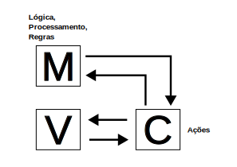
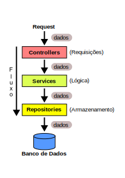

# Design e Arquitetura I - 26/04/2025

## Arquitetura MVC (Model-View-Controller)



### Component-Based vs Action-Based

As abordagens Component-Based e Action-Based são dois estilos de arquitetura
utilizados no desenvolvimento de aplicações web, especialmente em frameworks
MVC. Elas determinam como as requisições são tratadas, como a lógica é
estruturada e como a interface do usuário é gerenciada.

#### Component-Based

**Características:**

- A UI é composta por componentes reutilizáveis com estado próprio.
- Cada componente lida com sua própria renderização, eventos e ciclo de vida.
- A aplicação é mais parecida com uma aplicação desktop dentro do navegador.
- O fluxo de controle é mais orientado a eventos do que a ações (handlers).

**Exemplos de frameworks:**

- JavaServer Faces (JSF)
- Tapestry
- Wicket

**Vantagens:**

- Reuso e encapsulamento de componentes.
- Ideal para aplicações com interfaces ricas e interativas.
- Reduz a quantidade de lógica de controle distribuída.

**Desvantagens:**

- Curva de aprendizado mais acentuada.
- Pode gerar HTML menos previsível.
- Difícil de debugar em grandes sistemas sem ferramentas específicas.

#### Action-Based

**Características:**

- A aplicação responde a ações ou requisições HTTP específicas.
- A estrutura segue o fluxo requisição → ação → resposta.
- Mais próximo do modelo tradicional da web: uma página = uma ação.
- Controllers ou Handlers lidam com ações específicas como "salvar", "editar",
  etc.

**Exemplos de frameworks:**

- Spring MVC
- Struts

**Vantagens:**

- Mais previsível e transparente quanto ao que acontece em cada requisição.
- Melhor integração com URLs RESTful.
- Mais simples para quem já conhece o modelo HTTP tradicional.

**Desvantagens:**

- Reuso de interface exige mais código (comparado aos componentes).
- Pode levar à duplicação de lógica em páginas semelhantes.

## Contêiner Web vs Servidor de Aplicação

### Contêiner Web

Um contêiner web (web container) é um ambiente de execução especializado para
aplicações web, especialmente aquelas desenvolvidas com tecnologias como
Servlets, JSP, JSF, etc., no contexto de Java EE (Jakarta EE).

- Ele gerencia o ciclo de vida de componentes web, como Servlets.
- Lida com HTTP, sessões, autenticação, segurança, mapeamento de URLs, etc.
- Exemplo: Apache Tomcat (ele é apenas um contêiner web, não um servidor de
  aplicação completo).

**Vantagens:**

- Mais leve e rápido para iniciar
- Simples de configurar
- Ideal para serviços REST, APIs, sites web simples

**Desvantagens:**

- Não suporta funcionalidades Java EE completas, como EJBs ou transações
  distribuídas
- Menos indicado para sistemas corporativos complexos

**Quando usar:**

- Site, API REST simples, microsserviços

### Servidor de Aplicação

Um servidor de aplicação é uma plataforma completa para executar aplicações
corporativas, que oferece suporte não só a componentes web (pois contém um
contêiner web), mas também a:

- EJBs (Enterprise JavaBeans)
- JTA (transações distribuídas)
- JMS (mensageria)
- JNDI (lookup de recursos)
- Segurança corporativa
- Monitoramento e clustering
- Exemplos: WildFly (ex-JBoss), GlassFish, WebLogic e WebSphere

**Vantagens:**

- Suporta todo o Java EE / Jakarta EE
- Escalabilidade, clustering, transações distribuídas
- Mais completo para sistemas empresariais

**Desvantagens:**

- Mais pesado e complexo
- Pode ser mais difícil de configurar e manter
- Overkill para projetos pequenos ou microsserviços simples

**Quando usar:**

- Aplicação Java corporativa, legado ou distribuída

## Framework

Um framework é um conjunto de bibliotecas, ferramentas, configurações,
convenções, classes/interfaces, arquitetura, conceitos e padrões de projeto que
fornece uma estrutura básica para desenvolver aplicações.

> Em vez de começar do zero, você usa o framework como base e escreva seu código
> dentro das regras e estruturas que ele define.

Exemplo: Spring (Java), Django (Python), Angular (JavaScript), etc.

**Características:**

- Define regras e convenções (ex: estrutura de pastas, ciclo de vida dos
  objetos).
- Fornece componentes reutilizáveis.
- Controla parte do fluxo da aplicação (isso é chamado de Inversão de Controle,
  ou IoC).

**Vantagens:**

- Produtividade maior: Muito do trabalho comum já está pronto.
- Segurança embutida: Muitos frameworks protegem contra ataques comuns.
- Organização de código: Ajuda a manter padrões e escalabilidade.
- Comunidade ativa: Muitos frameworks têm boa documentação e suporte da
  comunidade.

**Desvantagens:**

- Curva de aprendizado: Você precisa aprender a "forma certa" de usá-lo.
- Rigidez: Pode ser difícil fazer coisas fora do que o framework permite.
- Peso: Frameworks podem adicionar dependências ou funcionalidades que você não
  precisa.

## Classes Anêmicas vs Classes Ricas

### Classe Anêmica

Uma classe anêmica (anemic class) é uma classe que contém apenas dados
(atributos) com pouca ou nenhuma lógica de negócio. Ela funciona quase como uma
estrutura de dados: guarda o estado, mas não sabe operar sobre ele.

**Características:**

- Apenas getters e setters.
- Sem regras de negócio internas.
- A lógica fica espalhada em serviços externos (geralmente com nomes como
  `PessoaService`, `ContaService`, etc).
- Viola o princípio de encapsulamento da OOP.

**Exemplo:**

```java
public class Conta {
    private double saldo;

    public double getSaldo() {
        return saldo;
    }

    public void setSaldo(double saldo) {
        this.saldo = saldo;
    }
}
```
A lógica como `sacar`, `depositar` ou `verificar limite` estaria em outro lugar.

**Vantagens:**

- Simples de entender (especialmente para iniciantes).
- Pode facilitar integração com APIs ou ORMs (como JPA, Hibernate).

**Desvantagens:**

- Baixo encapsulamento.
- Código espalhado em muitos serviços.
- Difícil de manter em sistemas complexos.
- Viola princípios OO.

### Classe Rica

Uma classe rica (rich class ou rich domain model) encapsula tanto os dados
quanto a lógica que opera sobre eles. Ela "sabe fazer" as operações que dizem
respeito a si mesma. Isso reflete a realidade do domínio.

**Características:**

- Contém dados + regras de negócio.
- Alto nível de encapsulamento.
- Favorece o modelo orientado ao domínio (DDD).
- As decisões e validações acontecem dentro da própria classe.

**Exemplo:**

```java
public class Conta {
    private double saldo;

    public void depositar(double valor) {
        if (valor <= 0) {
            throw new IllegalArgumentException("Valor inválido");
        }
        this.saldo += valor;
    }

    public void sacar(double valor) {
        if (valor > saldo) {
            throw new IllegalStateException("Saldo insuficiente");
        }
        this.saldo -= valor;
    }

    public double getSaldo() {
        return this.saldo;
    }
}
```

**Vantagens:**

- Alta coesão e encapsulamento.
- Facilita manutenção, evolução e testes.
- Modelo reflete melhor o domínio do problema.
- Alinha-se ao DDD (Domain-Driven Design).

**Desvantagens:**

- Pode exigir mais disciplina de modelagem.
- Leva tempo para estruturar corretamente.
- Pode parecer "pesada" para aplicações muito simples.

## Modelo em Camadas (MVC)



## Modificadores de Acesso na Linguagem Java

| Modificador                           | Acesso permitido a...                                      | Palavras-chave        |
| ------------------------------------- | ---------------------------------------------------------- | --------------------- |
| **public**                            | Todos os lugares (sem restrição)                           | `public`              |
| **protected**                         | Mesmo pacote **ou** subclasses (mesmo que em outro pacote) | `protected`           |
| **package-private** (sem modificador) | Somente dentro do **mesmo pacote**                         | *(sem palavra-chave)* |
| **private**                           | Somente dentro da **mesma classe**                         | `private`             |

## Spring Framework

### Criar um Projeto

Para criar um projeto usando o Spring Boot vá ao site do [spring
initalizr](https://start.spring.io/) e escolha as opções:

- Project: `Maven`
- Language: `Java`
- Spring Boot: `3.4.6`
- Project Metadata:
  - Group: `com.github.username.projeto`
  - Artifact: `projeto`
  - Name: `projeto`
  - Description: `Descrição do Projeto`
  - Package name: Já vai estar configurado
  - Packaging: `Jar`
  - Java: `17`
- Dependencies: `Lombok`, `Spring Web`, `Spring Data JPA` e `H2 Database`

Dê um clique no botão `Generate`, faça o download do projeto, descompacte e
abra em alguma IDE/editor.

### Configuração

Criar o arquivo `application.yml` em `src/main/resources` (se houver um arquivo
`application.properties`, apagar) e editá-lo com:

```yaml
server:
  port: 8081
spring:
  application:
    name: projeto
  h2:
    console:
      enabled: true
  datasource:
    url: jdbc:h2:mem:projeto;DB_CLOSE_DELAY=-1;DB_CLOSE_ON_EXIT=FALSE
    driver-class-name: org.h2.Driver
    username: sa
    password: sa
```

Substituir o nome `projeto` no arquivo acima pelo nome do seu projeto. Este
arquivo criará um acesso ao RDBMS H2 em memória para fins didáticos.
Estas configurações serão aplicadas ao `Contexto` do Spring.

## Anotações das Principais Bibliotecas utilizadas no Projeto

### Lombok

| Anotação             | Descrição                                                                 | Categoria                  |
|----------------------|--------------------------------------------------------------------------|----------------------------|
| `@Getter`            | Gera métodos getters para todos os campos ou campos específicos          | Acesso a campos            |
| `@Setter`            | Gera métodos setters para todos os campos ou campos específicos          | Acesso a campos            |
| `@ToString`          | Gera um método `toString()`                                               | Métodos utilitários        |
| `@EqualsAndHashCode` | Gera `equals()` e `hashCode()`                                            | Métodos utilitários        |
| `@Data`              | Atalho para `@Getter`, `@Setter`, `@ToString`, `@EqualsAndHashCode`, `@RequiredArgsConstructor` | Composta                   |
| `@Value`             | Versão imutável de `@Data` (campos `final`, classe `final`, sem setters) | Composta                   |
| `@NoArgsConstructor` | Gera um construtor sem argumentos                                         | Construtores               |
| `@RequiredArgsConstructor` | Gera um construtor com campos `final` e `@NonNull`                 | Construtores               |
| `@AllArgsConstructor`| Gera um construtor com todos os campos                                   | Construtores               |
| `@Builder`           | Gera um padrão de projeto builder                                        | Padrões de projeto         |
| `@Singular`          | Usado com `@Builder` para adicionar itens únicos a coleções              | Padrões de projeto         |
| `@SneakyThrows`      | Permite lançar exceções sem declará-las                                 | Exceções                   |
| `@Synchronized`      | Versão segura de `synchronized` com nome de lock privado                 | Concorrência               |
| `@Getter(lazy=true)` | Cria um getter com inicialização preguiçosa (lazy initialization)        | Acesso a campos            |
| `@Cleanup`           | Garante o fechamento automático de recursos (como streams)               | Recursos                   |
| `@NonNull`           | Gera verificação de nulidade e exceção em parâmetros                     | Validação de argumentos    |
| `@Log`, `@Slf4j`, `@Log4j`, etc. | Gera uma instância de logger adequada                        | Logging                    |
| `@With`              | Gera métodos `withX()` para criar cópias imutáveis com novo valor        | Imutabilidade              |
| `@FieldDefaults`     | Define modificadores padrão para os campos (`private`, `final`, etc.)    | Configuração de campos     |
| `@Accessors`         | Customiza os nomes dos métodos getter/setter (por exemplo, fluent)       | Estilo de acesso           |
| `@SuperBuilder`      | Igual ao `@Builder`, mas suporta herança                                 | Padrões de projeto         |


### Spring Boot Starter Web

| Anotação             | Descrição                                                                                         | Parâmetros Comuns                                                                 |
|----------------------|---------------------------------------------------------------------------------------------------|-----------------------------------------------------------------------------------|
| `@RestController`    | Combina `@Controller` e `@ResponseBody`; usada para criar APIs RESTful.                           | —                                                                                 |
| `@Controller`        | Define uma classe como um controlador Spring MVC.                                                 | —                                                                                 |
| `@RequestMapping`    | Mapeia requisições HTTP para métodos manipuladores.                                               | `value`, `path`, `method`, `produces`, `consumes`                                 |
| `@GetMapping`        | Atalho para `@RequestMapping` com método GET.                                                     | `value`, `path`, `produces`, `consumes`                                           |
| `@PostMapping`       | Atalho para `@RequestMapping` com método POST.                                                    | `value`, `path`, `produces`, `consumes`                                           |
| `@PutMapping`        | Atalho para `@RequestMapping` com método PUT.                                                     | `value`, `path`, `produces`, `consumes`                                           |
| `@DeleteMapping`     | Atalho para `@RequestMapping` com método DELETE.                                                  | `value`, `path`, `produces`, `consumes`                                           |
| `@PatchMapping`      | Atalho para `@RequestMapping` com método PATCH.                                                   | `value`, `path`, `produces`, `consumes`                                           |
| `@RequestParam`      | Vincula parâmetros de consulta da URL a parâmetros de método.                                     | `name`, `required`, `defaultValue`                                                |
| `@PathVariable`      | Vincula variáveis de caminho da URL a parâmetros de método.                                       | `name`, `required`                                                                |
| `@RequestBody`       | Vincula o corpo da requisição HTTP a um parâmetro de método.                                      | `required`                                                                        |
| `@ResponseBody`      | Indica que o retorno do método deve ser escrito diretamente na resposta HTTP.                     | —                                                                                 |
| `@ResponseStatus`    | Define o status HTTP da resposta.                                                                 | `code`, `reason`                                                                  |
| `@ExceptionHandler`  | Define métodos para tratar exceções específicas lançadas por métodos do controlador.               | `value` (tipo da exceção)                                                         |
| `@ControllerAdvice`  | Permite tratamento global de exceções e vinculação de dados em todos os controladores.            | —                                                                                 |
| `@CrossOrigin`       | Habilita o compartilhamento de recursos entre origens diferentes (CORS).                          | `origins`, `methods`, `allowedHeaders`, `exposedHeaders`, `allowCredentials`      |
| `@ModelAttribute`    | Vincula atributos de modelo a parâmetros de método ou inicializa dados de modelo.                 | `value`, `binding`                                                                |
| `@InitBinder`        | Inicializa dados de ligação personalizados para métodos do controlador.                           | `value` (nomes dos atributos)                                                     |
| `@Validated`         | Ativa a validação de beans usando anotações de validação (JSR-303).                               | `value` (grupos de validação)                                                     |
| `@Valid`             | Indica que o parâmetro deve ser validado usando as anotações de validação.                        | —                                                                                 |
| `@RequestHeader`     | Vincula cabeçalhos HTTP a parâmetros de método.                                                   | `name`, `required`, `defaultValue`                                                |
| `@CookieValue`       | Vincula valores de cookies a parâmetros de método.                                                | `name`, `required`, `defaultValue`                                                |


### Spring Boot Starter Data JPA

| Anotação               | Descrição                                                                                             | Parâmetros Comuns                                                                 |
|------------------------|-------------------------------------------------------------------------------------------------------|-----------------------------------------------------------------------------------|
| `@Entity`              | Marca uma classe como uma entidade JPA, mapeando-a para uma tabela no banco de dados.                 | —                                                                                 |
| `@Table`               | Especifica o nome da tabela e outras configurações relacionadas à tabela.                             | `name`, `schema`, `catalog`, `uniqueConstraints`                                  |
| `@Id`                  | Define o campo como chave primária da entidade.                                                       | —                                                                                 |
| `@GeneratedValue`      | Especifica a estratégia de geração de valores para a chave primária.                                  | `strategy` (AUTO, IDENTITY, SEQUENCE, TABLE), `generator`                         |
| `@Column`              | Define o mapeamento de um campo para uma coluna da tabela.                                            | `name`, `nullable`, `unique`, `length`, `columnDefinition`                        |
| `@JoinColumn`          | Especifica a coluna de junção para relacionamentos.                                                   | `name`, `referencedColumnName`, `nullable`, `unique`                              |
| `@OneToOne`            | Define um relacionamento um-para-um entre entidades.                                                  | `mappedBy`, `cascade`, `fetch`, `optional`                                        |
| `@OneToMany`           | Define um relacionamento um-para-muitos entre entidades.                                              | `mappedBy`, `cascade`, `fetch`                                                    |
| `@ManyToOne`           | Define um relacionamento muitos-para-um entre entidades.                                              | `cascade`, `fetch`, `optional`                                                    |
| `@ManyToMany`          | Define um relacionamento muitos-para-muitos entre entidades.                                          | `mappedBy`, `cascade`, `fetch`                                                    |
| `@JoinTable`           | Especifica a tabela de junção para relacionamentos muitos-para-muitos.                                | `name`, `joinColumns`, `inverseJoinColumns`                                       |
| `@Embedded`            | Incorpora um objeto em uma entidade.                                                                 | —                                                                                 |
| `@Embeddable`          | Define uma classe cujas instâncias são incorporadas em outras entidades.                             | —                                                                                 |
| `@Transient`           | Indica que o campo não deve ser persistido no banco de dados.                                         | —                                                                                 |
| `@Enumerated`          | Especifica como os enums devem ser persistidos.                                                       | `EnumType` (ORDINAL, STRING)                                                      |
| `@Lob`                 | Indica que o campo deve ser tratado como um Large Object (CLOB ou BLOB).                              | —                                                                                 |
| `@Temporal`            | Especifica o tipo temporal de um campo `Date`.                                                        | `TemporalType` (DATE, TIME, TIMESTAMP)                                            |
| `@Query`               | Define uma consulta personalizada usando JPQL ou SQL nativo.                                          | `value`, `nativeQuery`                                                            |
| `@Modifying`           | Indica que a consulta modifica dados (INSERT, UPDATE, DELETE).                                        | `clearAutomatically`, `flushAutomatically`                                        |
| `@Procedure`           | Mapeia um método para uma procedure armazenada no banco de dados.                                     | `name`, `procedureName`                                                           |
| `@Lock`                | Especifica o tipo de bloqueio para uma consulta.                                                      | `LockModeType` (READ, WRITE, OPTIMISTIC, etc.)                                    |
| `@EnableJpaRepositories` | Ativa a criação automática de implementações de repositórios JPA.                                   | `basePackages`, `repositoryFactoryBeanClass`, `entityManagerFactoryRef`           |
