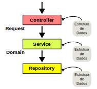
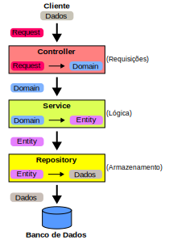
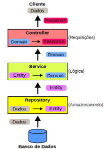

# Design e Arquitetura I - 10/05/2025

## Regra de Dependência



## Fluxo para Salvar em um Banco de Dados



## Fluxo para Recuperar de um Banco de dados



## Spring Framework

### Salvar os dados de um Produto no Banco de Dados

- No pacote `controller`, criar a classe `ProductController`, que:
  - Utiliza a classe `ProductRequest` para transformar um `ProductRequest` em
  `ProductDomain`
  - Passa o `ProductDomain` para a camada `service` para ser criado

```java
@AllArgsConstructor
@RestController
@RequestMapping("api/v1/products")
public class ProductController {
    private final ProductService productService;

    @PostMapping
    public String create(@RequestBody ProductRequest productRequest) {
       this.productService.create(productRequest.asProductDomain());
        return "product created with success";
    }
}
```

- No pacote `controller.request`, criar a classe `ProductRequest` que transforma
  um `ProductRequest` em `ProductDomain`

```java
@Data
@Builder
public class ProductRequest implements Serializable {
    private String name;
    private String description;
    private BigDecimal price;
    private Integer amount;

    public ProductDomain asProductDomain() {
        return ProductDomain.builder()
                .name(this.name)
                .description(this.description)
                .amount(this.amount)
                .price(this.price)
                .build();    }
}
```

- Em `service.domain`, criar a classe `ProductDomain`, que transforma um
  `ProductDomain` em `ProductEntity`

```java
@Builder
@Data
public class ProductDomain {
    private Long id;
    private String name;
    private String description;
    private BigDecimal price;
    private Integer amount;

    public ProductEntity asProductEntity() {
        return ProductEntity.builder()
                .name(this.name)
                .description(this.description)
                .amount(this.amount)
                .price(this.price)
                .build();
    }
}
```

- No pacote `service`, criar a interface `ProductService` e a classe
  `ProductServiceImpl`, que é responsável por receber um `ProductDomain` e
  passá-lo para o repositório para ser persistido

```java
public interface ProductService {
    ProductDomain create(ProductDomain domain);
}
```

```java
@AllArgsConstructor
@Service
public class ProductServiceImpl implements ProductService {
    private final ProductRepository productRepository;
    @Override
    public ProductDomain create(ProductDomain domain) {
        var entity = this.productRepository.save(domain.asProductEntity());
        return domain.toProductDomain(entity);
    }
}
```
- No pacote `model`, criar a classe `ProductEntity` que irá persistir os dados
  em um banco de dados

```java
@AllArgsConstructor
@NoArgsConstructor
@Data
@Builder
@Entity
@Table(name = "products")
public class ProductEntity {
    @Id
    @GeneratedValue(strategy = GenerationType.AUTO)
    private Long id;
    private String name;
    private String description;
    private BigDecimal price;
    private Integer amount;
}
```

- No pacote `repository`, criar a interface `ProductRepository`, que estende de
  `JpaRepository` e é responsável por persistir uma dados de um `ProductEntity`
  em uma tabela do banco de dados

```java
@Repository
public interface ProductRepository extends JpaRepository<ProductEntity, Long> {
}
```

### Recuperar os dados de um Produto no Banco de Dados pelo nome

- Na interface `ProductRespository`, localizada no pacote `repository` adicionar
  o método `getByname`, que recebe como parâmetro um nome e retorna um
  `ProductEntity`

```java
@Repository
public interface ProductRepository extends JpaRepository<ProductEntity, Long> {
    ProductEntity getByName(String name);
}
```

- Na interface `ProductService` adicionar o método `getProductName` que recebe
  como parâmetro o nome do produto e retorna um `ProductDomain`

```java
public interface ProductService {
    ProductDomain create(ProductDomain domain);
    ProductDomain getProductName(String name);
}
```

- Na classe `ProductServiceImpl`, criar o método `getProductName` que:
  - Recebe o nome do produto como parâmetro
  - Busca o produto no repositório utilizando o nome do produto
  - Transforma um `ProductEntity` em `ProductDomain`
  - Retorna para o controller o `ProductDomain`

```java
@AllArgsConstructor
@Service
public class ProductServiceImpl implements ProductService {
    private final ProductRepository productRepository;

    @Override
    public ProductDomain create(ProductDomain domain) {
        var entity = this.productRepository.save(domain.asProductEntity());
        return  domain.toProductDomain(entity);
    }

    @Override
    public ProductDomain getProductName(String name) {
        return ProductDomain.builder()
        .build().toProductDomain(this.productRepository.getByName(name));
    }
```

- Na classe `ProductDomain`, criar o método `toProductDomain` que transforma
  um `ProductEntity` em `ProductDomain`

```java
@Builder
@Data
public class ProductDomain {
    private Long id;
    private String name;
    private String description;
    private BigDecimal price;
    private Integer amount;

    public ProductEntity asProductEntity() {
        return ProductEntity.builder()
                .name(this.name)
                .description(this.description)
                .amount(this.amount)
                .price(this.price)
                .build();
    }

    public ProductDomain toProductDomain(ProductEntity entity) {
        return ProductDomain.builder()
            .id(entity.getId())
                .price(entity.getPrice())
                .amount(entity.getAmount())
                .name(entity.getName())
                .description(entity.getDescription())
                .build();
    }
}
```

- Na classe `ProductController`, criar o método `getProductByName` que:
  - Recebe um nome de produto via `get` do HTTP, na url
    `api/v1/products/name/nome-do-produto`
  - Chama o método `getProductName` da camada `service`, passando o nome do
    produto
  - Transforma o `ProductDomain` que retornado pela camada `service` em um
    `ProductResponse`

```java
@AllArgsConstructor
@RestController
@RequestMapping("api/v1/products")
public class ProductController {
    private final ProductService productService;

    @PostMapping
    public String create(@RequestBody  ProductRequest productRequest) {
       this.productService.create(productRequest.asProductDomain());
        return "product created with success";
    }

    @GetMapping("name/{name}")
    public ProductResponse getProductByName(@PathVariable String name){
        return ProductResponse.builder().build()
        .toProductResponse(this.productService.getProductName(name));
    }
```

- No pacote `controller.response` cria a classe `ProductResponse` que transforma
  um `ProductDomain` em um `ProductResponse`

```java
@Data
@Builder
public class ProductResponse {
    private Long id;
    private String name;
    private String description;
    private BigDecimal price;
    private Integer amount;

    public ProductResponse toProductResponse(ProductDomain domain) {
        return ProductResponse.builder()
            .amount(domain.getAmount())
            .price(domain.getPrice())
            .description(domain.getDescription())
            .name(domain.getName())
            .id(domain.getId())
            .build();
    }
}
```
