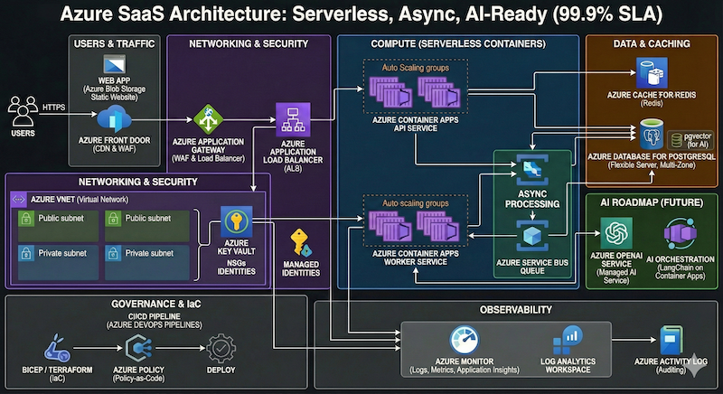
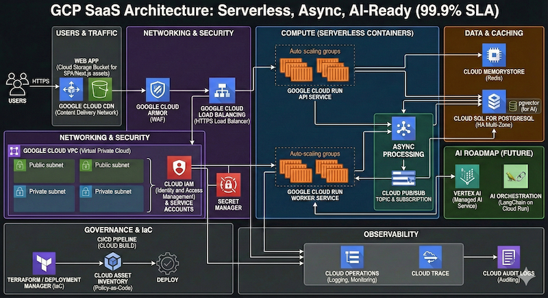

# **Cloud Computing e Inteligência Artificial: Exercícios**
<!-- _paginate: false -->

---

## Exercício 1: Matriz de decisão

Escolha AWS vs Azure vs GCP para o cenário A.

<b>Entrega do grupo (1 slide)</b>

1) Scorecard preenchido
2) Decisão (1 frase)
3) 3 argumentos técnicos
4) 2 riscos + mitigação

<b>Regras</b>

- Assuma um time real (skills limitadas)
- Considere operação e custos
- Cite onde há lock-in
- Se quiser, proponha híbrido/multi-cloud

---

## Cenário A: SaaS B2B multi-tenant (escala em horário comercial)

- API + workers assíncronos + web app
- Banco relacional transacional + cache
- 99.9% e picos em horário comercial
- Observabilidade forte + auditoria
- Roadmap de IA (RAG / embeddings) em ~6 meses
- Governança: IaC + policy-as-code (evitar "snowflakes")
- Equipe: 6 devs + 1 pessoa "cloud generalista"

---

## Worksheet: scorecard

| Critério                  | Peso | AWS (0–5) | Azure (0–5) | GCP (0–5) |
|---------------------------|:----:|:---------:|:-----------:|:---------:|
| Fit do workload           |   3  |     5     |      4      |      4    |
| Operação / day-2          |   2  |     4     |      3      |      4    |
| Segurança / identidade    |   3  |     4     |      5      |      4    |
| Economia (FinOps)         |   3  |     3     |      5      |      4    |
| Dados / analytics / IA    |   2  |     4     |      4      |      5    |
| Ecossistema / skills      |   1  |     5     |      4      |      3    |
| Compliance / região       |   2  |     5     |      5      |      4    |
| Lock-in (reversibilidade) |   2  |     3     |      3      |      4    |

---

## Worksheet: scorecard

| Cloud Provider | Score |
|:--------------:|-------|
| AWS            | (3 x 5) + (2 x 4) + (3 x 4) + (3 x 3) + (2 x 4) + (1 x 5) + (2 x 5) + (2 x 3) = 73 |
| Azure          | (3 x 4) + (2 x 3) + (3 x 5) + (3 x 5) + (2 x 4) + (1 x 4) + (2 x 5) + (2 x 3) = 76 |
| GCP            | (3 x 4) + (2 x 4) + (3 x 4) + (3 x 4) + (2 x 5) + (1 x 3) + (2 x 4) + (2 x 4) = 73 |

Cloud Provider escolhido: **Microsoft Azure**

---

## Debrief: perguntas para defender a decisão

- Qual foi o critério que mais pesou? Por quê?

Fit do workload. Pois a API + workers assíncronos + web app precisam funcionar com alta disponibilidade (99,9%) e irão apresentar picos em horário comercial.

---

## Debrief: perguntas para defender a decisão

- Que parte você aceitou "lock-in"? E como reduzir o risco?

Na parte de IA, pois embora seja importante ela não é crítica, uma vez que tem um roadmap previsto para 6 meses. Para reduzir os riscos serão usadas camadas de abstração (interfaces internas e wrappers), padrões open-source ou multiplataforma (PostgreSQL, PyTorch/TF em container) e evitar APIs proprietárias (utilizar serviços padrão), minimizando assim a probabilidade de ter de reescrever integrações, dados ou processos.

---

## Debrief: perguntas para defender a decisão

- Onde o custo pode explodir? Quais guardrails você colocaria?

**Workload**: configurar alocação de recursos (VMs, disco, etc.) elástica, mas com a liberação dos recursos alocados quando não são mais necessários (fora do horário comercial ou finais de semana)
**Observabilidade**: gerenciar a ingestão/retensão de logs, limitando a logar apenas o necessário
**Alerta de custos**: colocar um alerta se os custos ultrapassar um determinado valor

---

## Debrief: perguntas para defender a decisão

- Como você mede sucesso? (SLO/SLI + custo + velocidade de entrega)

Definir os SLOs/SLIs e garantí-los no menor custo possível associado a menor tempo de deploy, agregando valor para o cliente.

---

## Debrief: perguntas para defender a decisão

- Se o time mudar (skills/stack), sua decisão muda?

Não, pois a solução será baseada em camadas de abstração, padrões open-source ou multiplataforma de forma que outros membros que por ventura entrem no time, possam dar continuidade aos serviços providos.

---

## Exercício 2: Arquitetura macro

---

## Exercício 2: Arquitetura macro (Explicação)

1. Estratégia de Compute: Serverless-First

- Utilização de uma solução em nuvem para cuidar do escalonamento e do "health check" do container. Se ele travar durante um pico, a plataforma o substitui automaticamente.
- Picos: o escalonamento é baseado em requisições simultâneas ou CPU, reagindo em segundos aos picos do horário comercial.

---

## Exercício 2: Arquitetura macro (Explicação)

2. Camada de Tráfego e Rede

- Web App: hospedado em Object Storage atrás de uma CDN. Operação zero: não há servidor para cair.
- API Load Balancing: um Load Balancer gerenciado (ALB/Cloud Load Balancer) faz o offload de TLS/SSL.
- Rede: isolamento em Subnets Privadas para banco e workers, com acesso via NAT Gateway.

---

## Exercício 2: Arquitetura macro (Explicação)

3. Dados e Performance (O Coração Transacional)

- Banco Relacional: PostgreSQL Gerenciado em Multi-AZ.
- Operação: o backup é automático e point-in-time. Se o datacenter principal falhar, o failover para a zona secundária acontece sem intervenção manual, garantindo 99.9% de disponibilidade.
- Cache: Redis Gerenciado. Essencial para absorver picos de leitura
- IA: habilitar a extensão pgvector do PostgreSQL, permitindo armazenar embeddings no mesmo banco, evitando a complexidade.

---

## Exercício 2: Arquitetura macro (Explicação)

4. Processamento Assíncrono (Workers)

- Mensageria: SQS ou Pub/Sub.
- Fluxo: a API recebe o dado e joga na fila. O Worker (rodando no mesmo modelo de containers da API) processa em background.
- IA Readiness: processar LLMs ou gerar embeddings é demorado. Ter essa arquitetura de workers é o que permitirá integrar IA sem degradar a experiência do usuário principal.

---

## Exercício 2: Arquitetura macro (Explicação)

5. Governança e Observabilidade

- IaC (Terraform/Pulumi): criação de módulos padrão que os devs usam para subir novos recursos.
- Policy-as-Code (Checkov/Sentinel): regras automáticas que impedem, por exemplo, que um dev crie um banco de dados aberto para a internet.
- Observabilidade: centralizada (Datadog, New Relic ou Grafana Cloud).
- Logs: auditoria completa para saber "quem fez o quê".

---

## Arquitetura - AWS

---

## Arquitetura - Azure

---

## Arquitetura - GCP

---

## Exercício 3: IAM "least privilege" (puzzle)

| Quem (Identidade) | Ação (O quê) | Onde (Recurso) | Ambiente |
|-------------------|--------------|----------------|----------|
|Identidade App|Escrita (Write)|Bucket B|Produção|
|Identidade Data|Leitura (Read)|Bucket A|Produção|
|Time Segurança|Audit / Admin|Todo o Tenant|Dev + Prod|
|Time Dev (User)|Full Control|Recursos de Dev|Dev|
|Time Dev (User)|Bloqueado|Bucket A e B|Produção|

---

## Exercício 4: corte 25% do custo

| Item | Custo/mês (R$) | Observação |
|------|----------------|------------|
| Compute (VM/K8s) | 40.000 | Autoscaling agressivo + instâncias superdimensionadas |
| Banco relacional | 25.000 | IOPS provisionado alto; snapshots antigos |
| Observabilidade | 18.000 | Logs com retenção 90d e alta ingestão |
| Storage objeto | 9.000 | Lifecycle inexistente |
| Egress | 12.000 | Tráfego inter-região para analytics |
| Outros | 6.000 | IPs, discos órfãos, ambiente de teste sempre ligado |

---

## Exercício 4: corte 25% do custo

- Ação: reduzir as dimensões das VMs/K8s; Risco: degradar performance, instabilidade em cargas de pico, problemas de escalabilidade
- Ação: remover os snapshots antigos; Risco: remover um snapshot que mostrou-se necessário
- Ação: diminuir o tempo de rentenção de logs e a ingestão; Risco: precisar auditar um acesso indevido e não ter o log
- Ação: implantar um lifecycle dos storages de objetos; Risco: perda de dados importantes, acesso lento ou indisponibilidade do objeto
